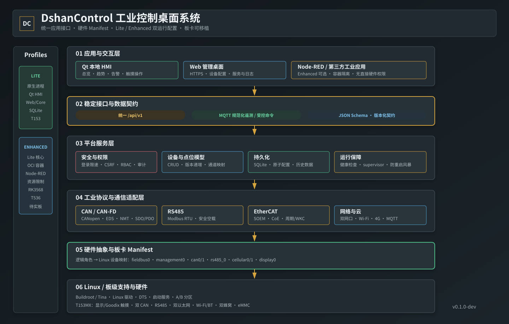

# DshanControl

## T153MX 实板桌面

以下界面均由运行 Linux `#69` 的 T153MX 通过 `fbgrab` 从真实 framebuffer 获取，
不是设计稿或模拟器截图。采集信息、逐图校验值和测试边界见
[实板 UI 记录](docs/t153mx-board-ui.md)。

<table>
  <tr>
    <td><strong>运行总览</strong><br></td>
    <td><strong>CAN / CANopen</strong><br></td>
  </tr>
  <tr>
    <td><strong>RS485 / Modbus</strong><br></td>
    <td><strong>EtherCAT</strong><br></td>
  </tr>
  <tr>
    <td><strong>网络通信</strong><br></td>
    <td><strong>设备监控</strong><br></td>
  </tr>
  <tr>
    <td><strong>告警记录</strong><br></td>
    <td><strong>系统设置</strong><br></td>
  </tr>
</table>

DshanControl 是一个面向工业网关、边缘控制器和带屏设备的开源工业控制桌面系统。
它提供统一设备模型、Qt 本地 HMI、Web 管理、服务自愈、工业协议适配契约，以及
Lite/Enhanced 两类运行配置。

当前版本为 `0.1.0-dev`，已经在 Allwinner T153 开发板完成短时软件验收，但不是
IEC 62443 认证产品，也不能替代具体现场总线从站的互操作测试。

## 主要能力

- 统一 `/api/v1`：平台、通道、系统状态、设备、点位和审计。
- Qt/C++ 1024×768 工业 HMI：深灰主题、状态色、趋势、告警和总线操作入口。
- Web 管理：认证、CSRF、角色、登录限速、安全响应头和可选 HTTPS。
- CAN/CAN-FD、CANopen、Modbus RTU、SOEM EtherCAT 和蜂窝适配接口。
- SQLite 持久化、配置原子写入、健康检查和有限重启 supervisor。
- Enhanced Node-RED 4.1.7 配置：登录保护、持久卷、资源限制且无硬件设备权限。
- 机器可读的运行 profile、板卡描述、硬件 Manifest 和 MQTT 数据 Schema。

## 目录

```text
components/       core、HMI、Web、supervisor 等可复用组件
platform/         profiles、boards、contracts、schemas 和 Node-RED 配置
deploy/           板卡运行时 Manifest 与开源服务接入示例
docs/             架构、移植、安全和发布说明
scripts/          测试与源码发布工具
tests/            平台与 Web 自动化测试
```

应用必须通过 `/etc/omnigate/platform.json` 解析逻辑通道，不得写死 `can0`、
`eth0` 或 `/dev/tty*`。完整架构见 [platform/docs/architecture.md](platform/docs/architecture.md)，
新板卡移植见 [platform/docs/porting-guide.md](platform/docs/porting-guide.md)。

## 测试

```sh
make test-bootstrap
make test
```

## 发布边界

本仓库仅包含可复用的 GPL-3.0 开源平台源码和板卡接入示例。Allwinner BSP、无线固件、
厂商烧录工具和完整 T153 SDK 不属于本仓库。详见
[docs/open-source-release.md](docs/open-source-release.md)。

## 状态

- T153 Lite：短时实板软件测试通过；Goodix GT911 已在 `0x14` 注册为
  `/dev/input/event1`。五点物理触控准确性仍待人工确认。
- Enhanced：Node-RED 主机配置测试通过；RK3568/T536 实板测试未完成。
- 24 小时老化、生产安全基线、签名 OTA 和自动回滚尚未完成。

许可证：[GPL-3.0](LICENSE)。

## 系统架构



可编辑 Mermaid 源图和分层说明见
[docs/system-architecture.md](docs/system-architecture.md)。
