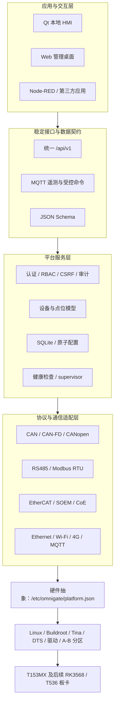

# DshanControl 系统架构

架构遵循单向依赖：应用只访问稳定 API/MQTT 契约，平台服务调用协议适配器，协议适配器
再通过硬件 Manifest 解析板级资源。这样更换 SoC 或 Linux 设备名时，不需要修改业务应用。

## Profile 边界

- Lite：原生 Core、Web、Qt HMI、supervisor、SQLite 和协议适配器，不安装 Node-RED。
- Enhanced：复用相同契约，增加受限 OCI 应用和 Node-RED；容器没有 CAN、串口、GPIO
  或 EtherCAT 原始网卡权限。

图中“支持”表示软件组件和契约已实现，不自动表示外部从站互操作、24 小时老化或生产
安全认证已经通过。
