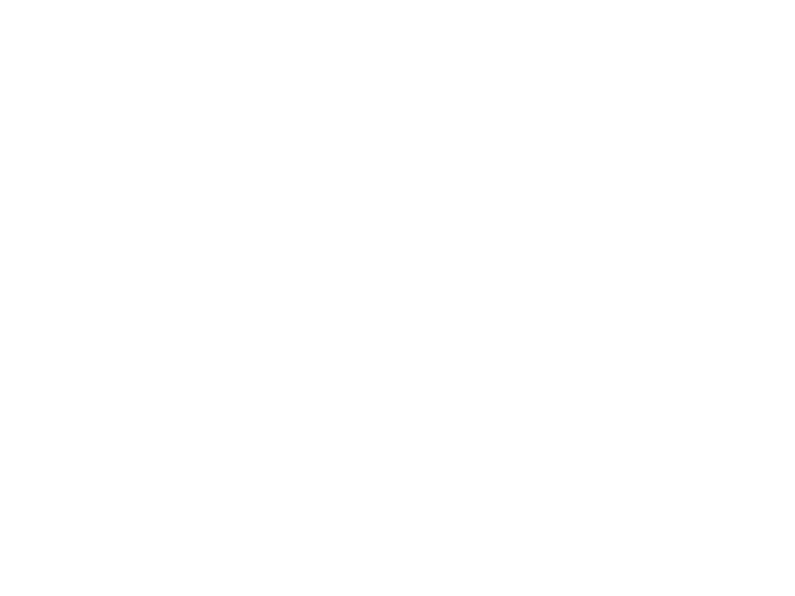

# T153MX 当前实板桌面

## 证据来源

- 采集日期：2026-09-16
- 采集方式：板端 `fbgrab` 直接读取真实 framebuffer
- 运行内核：`Linux Tina5.0 5.10.198 #69 SMP PREEMPT`
- 镜像大小：`604371968` bytes
- 镜像 SHA-256：`84914b6b79c59c5dd5221ba9aa59ae107c06d4826d193c10260ed7ce5cc87f17`
- 截图 SHA-256：`4a99cdb02598c8fa4e21329968302588da87997fdc70d0c0bd6d0837b07a0949`
- 烧写结果：`partition + verify + reboot` 成功，Boot0/Boot1 verified，
  `verifyState=success`、`verifyErrorCode=0`
- 启动检查：已消除缺失 `powerkey_display` / `powerkey_suspend` 和 NFS server
  的启动告警；冷启动日志未见 panic、Oops 或 OOM。

## 界面检查

- 顶部显示 CPU、内存、温度和存储；底部不重复这些指标。
- 使用统一深灰色体系，黄色用于状态线条和重点边框。
- 1024×768 截图中未见文字截断、控件重叠或蓝白主题混用。
- 默认非演示模式；无外部从站时显示真实的停止、离线或未知状态。

## 触摸状态

Goodix GT911 已在 I²C `0x14` 识别为 ID 967、版本 1060，并注册
`Goodix Capacitive TouchScreen` 与 `/dev/input/event1`。驱动枚举通过，物理触摸已由
现场用户在当前界面实际操作确认可用。

## 边界

这张图是 framebuffer 内容，不是包含板卡、屏幕边框和接线的相机照片。仓库当前状态
也不代表完成 24 小时老化、外部 CANopen/Modbus/EtherCAT 从站互操作或 IEC 62443
生产安全认证。
