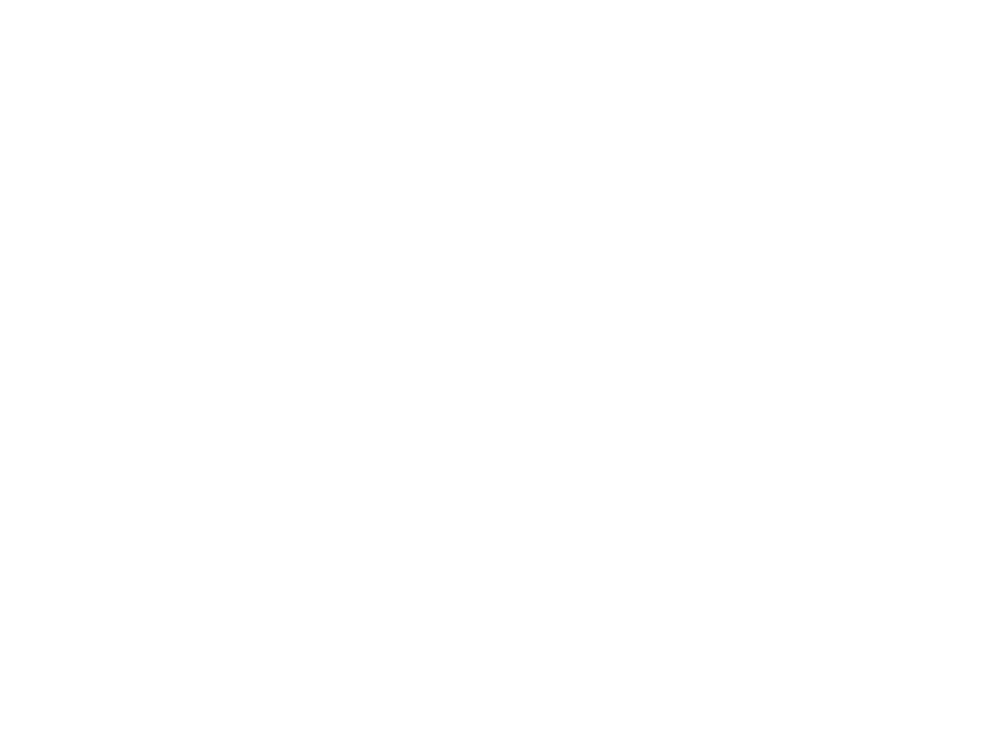

# T153 HMI 实板截图

该图片来自 T153MX 实板 `/dev/fb0`，分辨率为 1024×768，采集于 2026-09-16 的最近
一次成功启动验收。SHA-256：
`c38c68d77a719e41d67151df61280445330952685acd53161c7300ebbec35377`。

截图显示演示模式关闭、真实系统资源位于顶部、通信状态使用黄/绿/红功能色，底部不再
重复 CPU/内存/温度/存储指标。当前 Goodix 修复镜像因外部 USB 烧写链路失败尚未启动，
因此这张图用于证明当前 HMI 软件外观，不用于证明本轮触摸修复已经通过。
